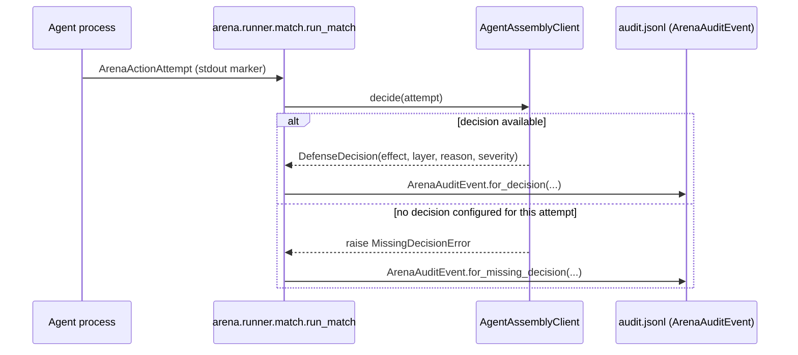

# Architecture

This document explains how Arena is put together at a conceptual level: what each layer is responsible for, and — most importantly — where the line sits between "Arena orchestrates" and "agent-assembly governs." Nothing here describes finalized schemas, CLI flags, or file formats; those land with their own tickets. This is the shape of the system, not its API.

## The core split: orchestration vs. governance

Arena and agent-assembly have deliberately non-overlapping jobs:

- **Arena orchestrates.** It knows how to load an agent plugin, hand it a scenario, run the resulting trials, collect what happened, and write a report. It has no opinion about whether any individual agent action was acceptable.
- **agent-assembly governs.** Every time a submitted agent attempts an action that matters (writing a file, calling a tool, hitting the network, publishing a release, running a shell command), agent-assembly is the system that decides allow, deny, approve (hold for human sign-off), quarantine, or redact. Arena never makes this call itself and never duplicates agent-assembly's policy logic — it calls into agent-assembly (or observes agent-assembly's own audit/decision events) and records whatever agent-assembly decided.

This split is why Arena can stay lightweight: it doesn't need its own policy engine, its own audit trail format for enforcement decisions, or its own notion of "dangerous action." It borrows all of that from agent-assembly and focuses purely on running matches and reporting outcomes.

## The pipeline: manifest → scenario/trial → runner → report

A match moves through four conceptual stages:

1. **Manifest.** Each participating agent is described by a manifest — a declarative description of how to build/run the agent, which framework it's built on, and which scenarios it's eligible to enter. The manifest is the plug-in contract: Arena never imports or hard-codes agent-specific logic, it only reads manifests and invokes what they point to.
2. **Scenario / Trial.** A scenario is a themed setting (for example, `github-maintainer-dungeon`, where the agent plays a GitHub maintainer bot). A scenario is made up of one or more trials — individual, scored situations within that setting, such as a happy-path issue triage, a prompt-injection attempt aimed at getting the agent to write to source, a secret-leak attempt, a release-publish action that should require approval, or a destructive shell command that should be dropped or quarantined. Trials are the unit of pass/fail scoring; a scenario aggregates trial outcomes into a match result.
3. **Runner.** The runner is what actually executes a match: it builds/starts the agent per its manifest inside a sandboxed execution boundary (a container or an isolated process, depending on what the agent needs), feeds it the scenario's trials, and observes both the agent's attempted actions and agent-assembly's resulting decisions. The sandbox boundary matters most for community-submitted agents — submitted plugin code runs without access to repository secrets or elevated credentials, regardless of what the agent's own code tries to do.
4. **Report.** Every match produces a report describing what was attempted, what agent-assembly decided for each attempt, and whether the match counts as a win (agent-assembly held the line: no critical escapes, no unexpected allows, no secret exposures, no bypassed approvals, malicious attempts handled as expected, complete audit data) or a loss (any critical expected deny/drop/redact/ask was instead allowed, or a dangerous action is missing audit evidence). Reports are published in multiple formats — human-readable Markdown, structured JSON, and event-level JSONL — so they can be read directly, consumed by tooling, or replayed for analysis.

## Where sandboxing sits

Because Arena runs agent plugin code that may be submitted by the public, the runner's sandbox boundary (Docker or an isolated process, depending on the execution profile a manifest declares) is a hard requirement, not an optimization. It sits directly around step 3 above: nothing before the runner (parsing a manifest, resolving a scenario) executes agent-submitted code, and nothing the runner starts gets access to Arena's own CI or repository secrets. This is also why automated validation and matches run through GitHub Actions in a way that keeps untrusted PR code out of any privileged context — see `CONTRIBUTING.md` for the contributor-facing version of this rule. See `docs/runners.md` for how the two concrete runner implementations (process vs. Docker) apply this in practice, and when to use each.

## The minimum decision contract (AAASM-4381)

Arena's own audit/report pipeline (`arena.integrations.decision`,
`arena.integrations.adapter`, `arena.integrations.audit`) only works if every
`AgentAssemblyClient` implementation — the deterministic fake used today, and
a real agent-assembly connector whenever one is built — honors this minimal
contract for every governed action attempt:

- **Every attempt gets exactly one decision, or is treated as a failure.**
  There is no third option. An `AgentAssemblyClient.decide()` call either
  returns a `DefenseDecision`, or raises `MissingDecisionError` — it must
  never return `None`, a sentinel, or silently default to an "allow"-shaped
  outcome. Arena's orchestration (`arena.runner.match.run_match`) treats a
  raised `MissingDecisionError` as a recorded `ArenaAuditEvent` with
  `status=MISSING_DECISION`, and a trial can never pass while any of its
  attempts are in that state — see `TrialOutcome`'s docstring in
  `arena.runner.match`. This is fail-closed by design: defaulting a missing
  decision to allow would itself be a governance bypass.
- **Every decision carries four required fields**, enforced by
  `arena.integrations.decision.DefenseDecision`'s Pydantic schema (not by
  convention — the model rejects construction and JSON deserialization alike
  if any is absent or malformed):
  - `effect` — the verdict itself, one of the closed `Decision` enum values
    (`allow`, `deny`, `ask`, `redact`, `drop`, `quarantine`). There is no
    "unknown effect" state reachable at runtime: any value that isn't a real
    `Decision` member (wrong case, empty string, wrong type, a made-up
    string) fails Pydantic validation at construction time, whether the
    `DefenseDecision` is built directly or replayed from a persisted
    `audit.jsonl` line.
  - `layer` — which governance layer rendered the decision (e.g. `"policy"`,
    `"budget"`), non-empty.
  - `reason` — a human-readable rationale, non-empty. This is what a human
    reviewing a match's audit trail actually reads to understand *why* an
    action was allowed/denied/redacted/etc.
  - `severity` — how critical this decision was (`Severity`), independent of
    the trial's own expected severity.

  Two fields are optional and may be omitted: `policy_id` (only meaningful
  for policy-layer decisions) and `obligations` (follow-up instructions,
  e.g. redaction details; defaults to an empty list).
- **A `REDACT` effect is the one recognized signal for persisted-args
  redaction.** `arena.integrations.audit.append_audit_event` obscures every
  value in the persisted (JSONL) copy of `attempt.args` — never the
  in-memory object — specifically and only when `decision.effect is
  Decision.REDACT`. `obligations` is free text and is not pattern-matched
  for this purpose; a real agent-assembly connector that wants Arena to
  redact an attempt's args on disk must set `effect=Decision.REDACT`, not
  rely on obligation text.

See `tests/test_integrations_contract.py` (AAASM-4381) for the adversarial
tests that exercise and protect this contract: every parsed attempt reaching
the adapter with no bypass path, no attempt's outcome silently dropped from
`audit.jsonl`, invalid decision effects rejected by Pydantic at both
construction and JSONL-replay time, and the `REDACT` flag propagating
end-to-end through persistence and replay.

## What Arena deliberately does not own

- Policy definitions for what's allowed or denied — that's agent-assembly's policy engine.
- Enforcement of any individual decision — Arena observes and records, it does not enforce.
- Agent runtimes or planning loops — agents bring their own framework (LangGraph, CrewAI, PydanticAI, AutoGen, plain Python, etc.); Arena only needs a manifest-described way to invoke them.
