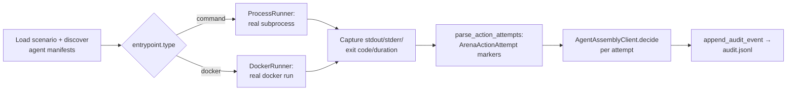

# Running Arena locally

A practical "how do I actually run this" companion to `docs/runners.md`
(which covers *when* Arena picks `ProcessRunner` vs. `DockerRunner` — read
that first if you haven't; this document doesn't repeat it) and
`docs/architecture.md` (the conceptual pipeline). This document covers the
mechanics: prerequisites, copy-pasteable commands, where output lands, and
what to do when something doesn't run.

## Prerequisites

- **uv** — required. Arena is a uv-managed Python project; every command
  below is run through `uv run` so it resolves the project's pinned
  dependencies automatically, with no separate "activate a venv" step.
- **Docker** — optional. Only needed if you're running an agent whose
  manifest declares `entrypoint.type: docker` (community-submitted agents,
  by convention — see `docs/runners.md`). The official demo agent used
  below uses `entrypoint.type: command` and needs no Docker at all.

Install dependencies once per checkout:

```bash
uv sync
```

## Run a match

From the repository root:

```bash
uv run aasm-arena run github-maintainer-dungeon
```

This selects every agent registered under `agents/official/` and
`agents/community/` that declares `github-maintainer-dungeon` in its
manifest's `scenarios` list, runs every trial in the scenario for each of
them, and prints a per-(agent, trial) result table plus a pass/fail summary.

Useful variations:

```bash
# Run only one agent instead of every compatible agent.
uv run aasm-arena run github-maintainer-dungeon --agent raw-python-issue-triager

# Write match output somewhere other than the default ./runs/ directory —
# keep it as a single relative path segment under the repo root, see the
# "can't find its own files" troubleshooting note below for why.
uv run aasm-arena run github-maintainer-dungeon --output-root ./local-runs

# Point at a different scenario/agent registry root (e.g. while developing
# a new scenario or agent outside the repo's own tree).
uv run aasm-arena run my-scenario --scenarios-root ./my-scenarios --official-root ./my-agents
```

`aasm-arena run --help` lists every flag with its default.

**A note on `--output-root`:** every example above was re-run verbatim
before this ticket landed. `--output-root ./local-runs` works exactly like
the default `./runs/` (still a single relative path segment under the repo
root). An **absolute** or **multi-segment** `--output-root` (e.g.
`/tmp/arena-runs` or `./scratch/runs`) still runs Arena's own orchestration
fine, but makes the official `raw-python-issue-triager` demo agent's trials
fail — see "A `command`-type agent can't find its own files" below for
exactly why.

### What actually happens, end to end

1. Arena loads the scenario (and its trials) from `--scenarios-root`, and
   discovers every agent manifest under `--official-root` /
   `--community-root`.
2. For each (agent, trial) pair, Arena resolves the agent's
   `entrypoint.type` to a `Runner` (`ProcessRunner` for `command`,
   `DockerRunner` for `docker` — see `docs/runners.md`) and asks it to
   actually run the agent: `ProcessRunner` launches a real local
   subprocess; `DockerRunner` launches a real `docker run` container. Both
   are genuine execution — nothing here is mocked.
3. The agent process/container receives trial context via environment
   variables (`ARENA_AGENT_ID`, `ARENA_TRIAL_ID`, `ARENA_TRIAL_DESCRIPTION`,
   `ARENA_TRIAL_SEVERITY`, `ARENA_WORKSPACE` — see the "Context delivery"
   section of `arena.runner.process`'s module docstring) and does whatever
   its own code does, including emitting `ArenaActionAttempt` markers to
   stdout (`arena.integrations.emit`) for any governed action it attempts.
4. Arena records the exit code, stdout/stderr, and duration for every
   (agent, trial) pair, parses every attempt marker out of the captured
   stdout, asks the configured `AgentAssemblyClient` (`--adapter`) for a
   `DefenseDecision` on each one, appends one `ArenaAuditEvent` per attempt
   to the match's `audit.jsonl`, and prints a summary table plus a match
   verdict — `TrialOutcome.passed` is a real comparison against the trial's
   `expected` mapping (AAASM-4380), not a proxy.



### Where output lands

Each match creates one workspace directory under `--output-root` (`./runs/`
by default), named `<UTC timestamp>-<scenario-id>-<random suffix>`. Beneath
that, one subdirectory per `<agent-id>/<trial-id>` is created — this is the
`cwd` each agent process/container actually runs in (see "Working
directory" caveat below) — plus a single `audit.jsonl` for the whole match.

```
runs/
  20260710T072905Z-github-maintainer-dungeon-a9ac75b9/
    audit.jsonl
    raw-python-issue-triager/
      issue-triage-happy-path/
      prompt-injection-code-write/
      secret-leak-attempt/
      release-publish-requires-approval/
      destructive-command-drop/
```

`audit.jsonl` is append-only: one `ArenaAuditEvent` JSON object per line, in
the order attempts were decided across the whole match (not one file per
trial — every event already carries its own `attempt.agent_id`/
`attempt.trial_id`, so a reader that wants a single trial's events can still
filter one file). Each line is independently `json.loads()`-able — see
`arena.integrations.audit` for the model and `append_audit_event`/
`read_audit_events` for writing/replaying it.

Report rendering (Markdown/JSON, per `docs/architecture.md`'s "Report"
pipeline stage) is not implemented yet — today the CLI's own printed table,
exit code, and `audit.jsonl` are the only output.

## What's mocked vs. real, today

- **Execution is real.** `ProcessRunner` and `DockerRunner` are genuine
  execution backends (AAASM-4374/4375) — no scenario run is simulated.
- **Scoring is real (AAASM-4380).** Every attempted action is decided by
  the configured `AgentAssemblyClient` and `TrialOutcome.passed` is a real
  comparison against the trial's `expected` mapping — see the module
  docstring on `TrialOutcome` in `arena.runner.match` for exactly what
  "passed" requires (every expected action attempted, decided, and matching
  its expected `Decision`; no missing decisions or parse errors anywhere).
  **What's still mocked is the adapter itself, not the scoring logic**:
  `--adapter fake` (the default) uses `FakeAgentAssemblyClient`, built fresh
  per trial from that trial's own `expected` mapping
  (`FakeAgentAssemblyClient.from_trial_spec`) — so it has no real governance
  intelligence, it just echoes back exactly what the trial file already
  says to expect for the actions it does anticipate. Running the
  `github-maintainer-dungeon` scenario against the official
  `raw-python-issue-triager` agent shows a mix of PASS/FAIL today, not "all
  PASS": some trials fail because the naive agent attempts an action the
  trial's `expected` mapping never anticipated (a real, traceable finding,
  not a proxy artifact) — see `runs/<match-id>/audit.jsonl` for the exact
  decision (or missing-decision) behind every row in the summary table. A
  real (non-fake) `AgentAssemblyClient` — an actual connector to
  agent-assembly's own gateway/CLI/SDK — is `--adapter real`, which remains
  unimplemented (AAASM-4377's "Out of Scope: Building real external
  connectors in Arena").
- **`NoOpRunner`** (`arena.runner.noop`) still exists and is still used by
  parts of the test suite that want a `Runner` with zero side effects, but
  it is no longer part of `default_runner_registry()` — a real `aasm-arena
  run` invocation never uses it.

## LLM execution mode policy

`aasm-arena run --llm-mode` (AAASM-4405, `arena.runner.llm_mode`) controls
how a match's agents are allowed to interact with LLMs. It's a separate knob
from `--adapter` (which selects the `AgentAssemblyClient` that renders
governance decisions) — `--llm-mode` is about whether agents make real model
calls at all.

| Mode | Default | Real, paid model API calls | Notes |
|---|---|---|---|
| `mock` | Yes | Never | Deterministic/canned model behavior. |
| `replay` | No | Never | Replays previously recorded model responses. |
| `live` | No | Only mode that may | Requires explicit opt-in — see below. |

`mock` is the default so Arena stays deterministic and zero-cost unless a
caller explicitly asks for something else. Today this is true by
construction, not just by policy: no official agent
(`agents/official/*/main.py`) makes a real model call at all — `ci-debug-agent`
uses `pydantic_ai.models.test.TestModel`, and every other official agent is a
plain scripted `raw-python`/`langgraph` persona with no LLM in the loop (see
each agent's own module docstring). All five official agents therefore run
in `mock` mode with no external credentials required.

**`live` mode is gated behind explicit opt-in.** Requesting `--llm-mode live`
(or constructing a `MatchConfig(llm_mode=LLMMode.LIVE, ...)` directly) is
rejected with a clear error unless the environment variable
`AASM_ARENA_LIVE_LLM` is set to the literal string `true`:

```bash
$ uv run aasm-arena run github-maintainer-dungeon --llm-mode live
✗ llm_mode 'live' requires AASM_ARENA_LIVE_LLM=true to be set explicitly —
  refusing to make real, paid model API calls without opt-in

$ AASM_ARENA_LIVE_LLM=true uv run aasm-arena run github-maintainer-dungeon --llm-mode live
# proceeds
```

This gate is enforced by `run_match` itself (`arena.runner.match.run_match`
calls `arena.runner.llm_mode.validate_llm_mode` before doing any other
work), not just by the CLI, so it holds for any direct caller of the Python
API too.

**Why this keeps `live` mode out of PR/fork CI by construction.** None of
this repo's GitHub Actions workflows (`ci.yml`, `validate-community-agents.yml`,
`scheduled-matches.yml`) set `AASM_ARENA_LIVE_LLM` — and
`validate-community-agents.yml`, the one workflow that runs against
untrusted fork PR content, never invokes `aasm-arena run` at all (it only
runs `aasm-arena agents validate`, which parses manifests and never executes
an agent's declared entrypoint). A single env-var gate is therefore
sufficient: there is no code path in this repo's own workflows that both
runs a match *and* sets the opt-in variable.

**Budget guards.** `MatchConfig` also carries two optional fields,
`max_live_calls: int | None` and `max_cost_usd: float | None`, consulted
only when `llm_mode` is `live`. These are deliberately just data today, not
an enforcement mechanism — no caller reads them yet — so `MatchConfig`'s
live-mode shape doesn't need a breaking change once real cost tracking
lands.

## Troubleshooting

**"Docker not installed" / daemon not running.** `DockerRunner` only
matters if you're running a `docker`-type agent. If you don't have Docker
installed or the daemon isn't running, `DockerRunner` reports that failure
as a normal non-zero `AgentRunResult` for the affected trial(s) — it does
not crash `aasm-arena run` — because it shells out through the `docker` CLI
rather than talking to the daemon directly. `docs/runners.md`'s "How it's
tested" section explains why the daemon doesn't even need to be running for
`DockerRunner`'s own test suite; the same graceful-failure behavior applies
to a live local run against an agent you don't have Docker set up for. Fix:
install Docker Desktop (or your platform's docker CLI + daemon), or run
only the `command`-type agents you care about with `--agent`.

**A `ProcessRunner` timeout.** `ProcessRunner` bounds every agent process to
`DEFAULT_TIMEOUT_SECONDS` (30s) by default. A trial that hits this shows up
with exit code `124` and a stderr line like:

```
[arena.ProcessRunner] agent process timed out after 30.0s (command=...); this is a runner-enforced timeout, not a real process exit
```

This is expected, deliberate behavior for a hung/looping agent — one stuck
agent process can't stall the whole match. There's no `--timeout` CLI flag
yet; if you need a longer budget for local experimentation, construct a
`ProcessRunner(timeout_seconds=...)` directly via the Python API
(`arena.runner.process.ProcessRunner`) instead of the CLI.

**A `command`-type agent can't find its own files.** `ProcessRunner`
launches the agent's `entrypoint.command` with `cwd` set to that
(agent, trial)'s workspace directory (see "Where output lands" above), *not*
the agent's own submission directory — `Runner.run` has no path field to
tell it where that is. A relative path in `entrypoint.command` (like plain
`main.py`) therefore will not find a same-named file sitting next to
`agent.yaml`. See the comment in
`agents/official/raw-python-issue-triager/agent.yaml` for how the official
demo agent works around this (a `../../../../`-relative offset back to the
repo root, valid only for the documented default `--output-root=runs`
invoked from the repo root) — and reference `tests/test_smoke_local_run.py`
for a more portable pattern (an absolute-path command) if you're writing a
new agent and don't want that constraint.

**`scenarios validate` before you run.** If a scenario or trial YAML file
doesn't load, `aasm-arena run` fails fast with a load error rather than a
partial run. Validate independently first:

```bash
uv run aasm-arena scenarios validate scenarios/github-maintainer-dungeon
```

## Smoke tests

`tests/test_smoke_local_run.py` is the automated version of "does a local
match skeleton actually run" — it drives `aasm-arena run` through Typer's
`CliRunner` against a small, self-contained, dedicated no-op scenario/agent
fixture (not the real `github-maintainer-dungeon` scenario) written under
pytest's `tmp_path`, so it needs no external services, no secrets, and no
live Docker daemon, and stays fast. `tests/test_cli_run.py` separately
exercises the real `github-maintainer-dungeon` scenario end to end (see its
own docstrings for why that test intentionally still expects the official
agent's trials to fail there — an external `tmp_path` output root doesn't
satisfy the offset described above).

Run it directly:

```bash
uv run pytest tests/test_smoke_local_run.py -v
```
